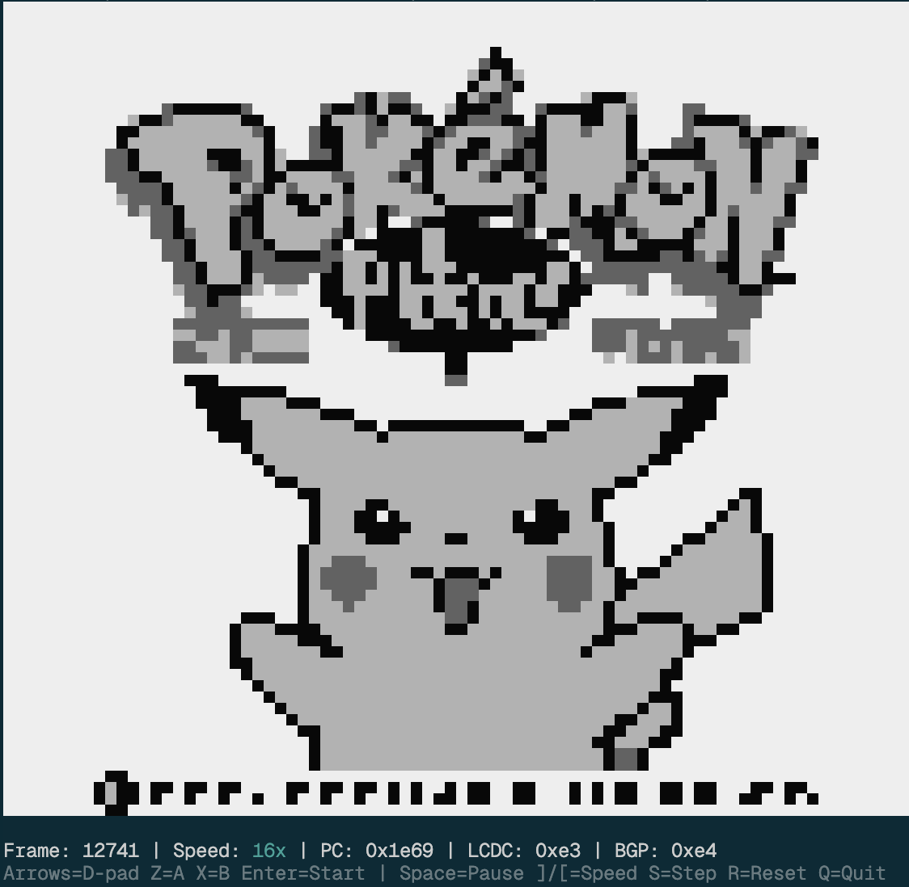

# gboy.ts

A Game Boy emulator in TypeScript, designed for the browser and serverless environments.

The emulator runs headlessly with no DOM or Canvas dependency. Frames render to a raw `Uint8Array` RGBA buffer that can be encoded to PNG/JPEG or rendered to a terminal.

[npm](https://www.npmjs.com/package/gboy-sts) | [Website](https://gboy-ts.vercel.app)

Terminal screenshot:



## Quick Start

```bash
# Install
bun install

# Run tests
bun test

# Debug a ROM in the terminal
bun run debug path/to/rom.gb --watch
```

## Examples

| Example      | Path                     | Description                                      |
| ------------ | ------------------------ | ------------------------------------------------ |
| Vite Browser | `examples/vite-browser/` | Client-side emulation via Web Worker + bidc      |
| Next.js      | `examples/nextjs/`       | Server-side emulation with App Router API routes |
| Screenshot   | `examples/screenshot.ts` | CLI tool to capture a PNG from any ROM           |

## Browser Demo (Worker + bidc)

Run the browser demo (Vite + Web Worker):

```bash
# From repo root:
bun install
bun --cwd examples/vite-browser install

# Start demo:
bun run demo:browser
```

Then open the printed local URL, load a `.gb`/`.gbc` ROM, and use keyboard controls:

- Arrows: D-pad
- `Z` / `X`: A / B
- `Enter` / `Backspace`: Start / Select
- Space: pause/resume

The browser worker protocol is powered by [`bidc`](https://github.com/vercel/bidc).

## Next.js Demo (App Router)

A full Next.js App Router example with server-side emulation and a Game Boy UI. Stores data in memory; move to e.g. Redis for statefulness.

```bash
# From repo root:
bun install
bun --cwd examples/nextjs install

# Place a ROM in the example directory:
cp path/to/rom.gb examples/nextjs/rom.gb

# Start the dev server:
bun run demo:nextjs
```

The app exposes four API routes:

| Route        | Method | Description                                       |
| ------------ | ------ | ------------------------------------------------- |
| `/api/frame` | GET    | Returns the current frame as PNG (`?advance=N`)   |
| `/api/input` | POST   | Sends a button press, returns the resulting frame |
| `/api/reset` | POST   | Resets the game, returns the first frame          |
| `/api/state` | GET    | Returns game info (title, ROM size, frame count)  |

Controls are the same as the browser demo (arrows, Z/X, Enter, Backspace, Space).

## Debug CLI

```bash
bun run debug <rom-path> [options]
```

### Options

| Flag             | Default      | Description                           |
| ---------------- | ------------ | ------------------------------------- |
| `--format <fmt>` | `green-half` | Render format (see below)             |
| `--width <n>`    | `80`         | Output width in characters            |
| `--frames <n>`   | `300`        | Frames to run (batch mode)            |
| `--interval <n>` | -            | Print every N frames (batch mode)     |
| `--press <btn>`  | -            | Press button at midpoint (batch mode) |
| `--stats`        | off          | Show framebuffer stats                |
| `--watch`        | off          | Interactive mode                      |

### Render Formats

| Format        | Description                                                      |
| ------------- | ---------------------------------------------------------------- |
| `green-half`  | Truecolor DMG green palette + half-block chars (highest quality) |
| `green`       | Truecolor DMG green, 1 char per pixel                            |
| `ansi-half`   | 256-color grayscale + half-blocks                                |
| `ansi`        | 256-color grayscale backgrounds                                  |
| `ascii`       | Punctuation shading: ` .:-=+*#%@`                                |
| `blocks`      | Unicode blocks: ` ░▓█`                                           |
| `half-blocks` | Unicode half-blocks (no color)                                   |

### Interactive Controls (--watch mode)

| Key            | Action                             |
| -------------- | ---------------------------------- |
| Arrow keys     | D-pad                              |
| `Z`            | A button                           |
| `X`            | B button                           |
| `Enter`        | Start                              |
| `Backspace`    | Select                             |
| `Space`        | Pause / Resume                     |
| `]` or `F`     | Speed up (1x / 2x / 4x / 8x / 16x) |
| `[` or `D`     | Slow down                          |
| `1`-`5`        | Set speed directly                 |
| `S`            | Step one frame (while paused)      |
| `I`            | Toggle stats overlay               |
| `R`            | Reset emulator                     |
| `Q` / `Ctrl+C` | Quit                               |

## Programmatic Usage

```typescript
import { Emulator, Button } from "./src/emulator";

// Load ROM
const rom = new Uint8Array(await Bun.file("pokemon.gb").arrayBuffer());
const emu = new Emulator(rom);

// Run frames
emu.runFrames(60);

// Handle input
emu.pressButton(Button.A);
emu.runFrames(5);
emu.releaseButton(Button.A);

// Get framebuffer (160x144 RGBA)
const fb = emu.getFramebuffer(); // Uint8Array, 92160 bytes

// Save state (excludes ROM data)
const state = emu.serialize();
await Bun.write("save.state", state);

// Restore state
const saved = new Uint8Array(await Bun.file("save.state").arrayBuffer());
const emu2 = Emulator.deserialize(rom, saved);
emu2.runFrames(1); // continues where it left off
```

### Browser Imports

Use the browser-safe entrypoint when bundling for the browser:

```typescript
import { BrowserEmulatorClient, Button } from "gboy-ts/browser";
```

`gboy-ts/browser` excludes Node-only exports like PNG encoding.

## Serialization

State serialization is designed for frequent save/load in serverless:

- ROM data is **never** included in serialized state
- Save state is ~110KB (CPU: 13B, MMU: 18KB, PPU: 92KB, Timer: 12B, Joypad: 9B, Cartridge: 8B + RAM)

## Known Limitations

- **No DMA timing** - OAM DMA transfer is not cycle-accurate

## Tests

```bash
bun test
bun test --watch      # Watch mode
bun test src/__tests__/cpu-alu.test.ts   # Run specific test file
```
